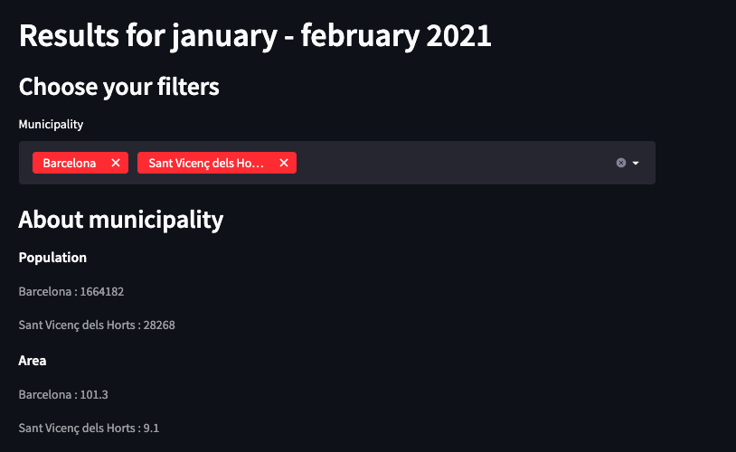
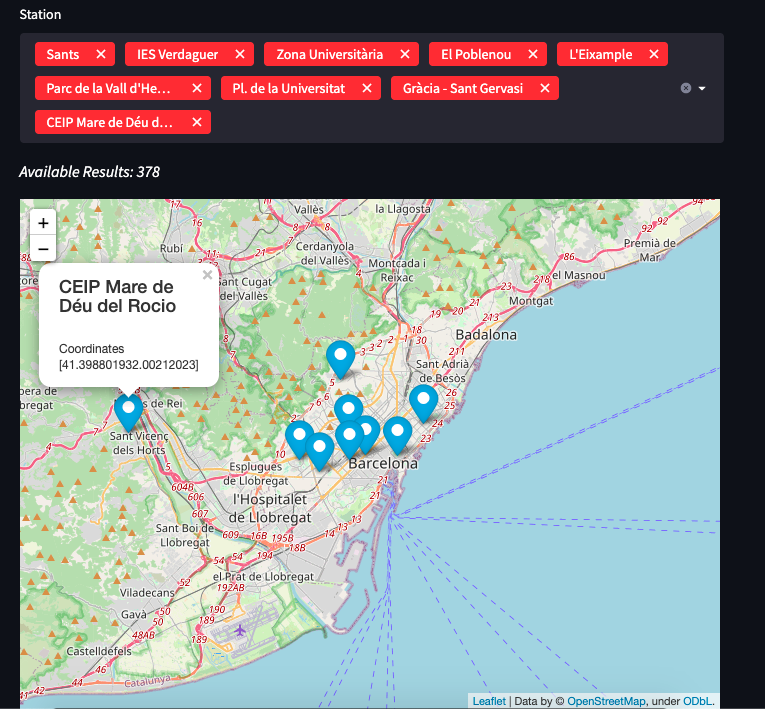
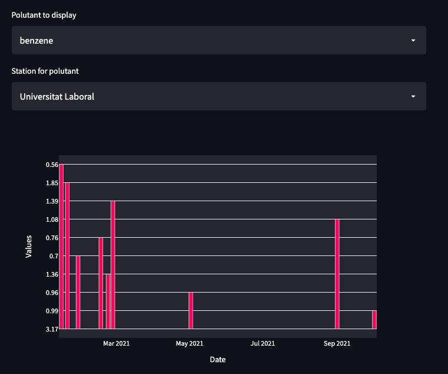

# Air Quality Application 🌀 
📦 🚀     Python application for "Open Data and Knowledge Graphs" course based on data from the city of Madrid and connected to wikidata

## Features

-   🔎  List and choice stations based on municipality
-   🔎  Visualize the position of the stations on the map
-   🔎  Search the pollutant to obtain the data about
-   🔎  Search for the station that contains measurements for a specific pollutant
-   🔎  Visualize mesurements data as a graph for the pollutant and station
-   🔎  Display additional data from wikidata based on the choices of the user

## Some techniques used 
-   ✨ streamlit
-   ✨ plotly
-   ✨ pillow
-   ✨ SPARQLWrapper
-   ✨ pandas

## Screenshots

